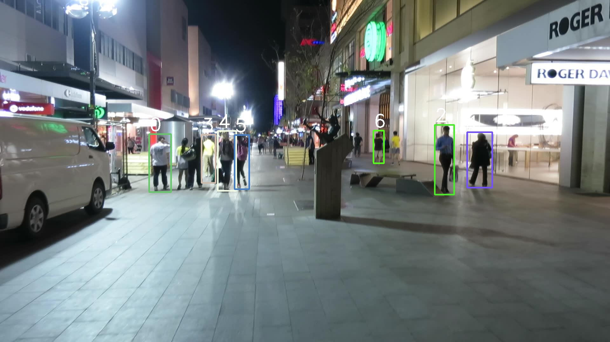

# Simple Online, Realtime Tracking package

Implementation of SORT on the MOT15 dataset

## Requirements and Dependencies
- Ubuntu 20.04
- OpenCV 4
- C++17
- yaml-cpp

## Detections

Detections are done via YOLOv8 ultralytics model, and saved into txt file in MOT15 format. 
Currently, only ADL datasets are available.

## Config
dataset, image_path and detections_path can be specified in config.yaml.
If not specified, detections will be obtained from ./det folder.
A valid image_path that contains the MOT15 dataset will be required for the executable to run.

